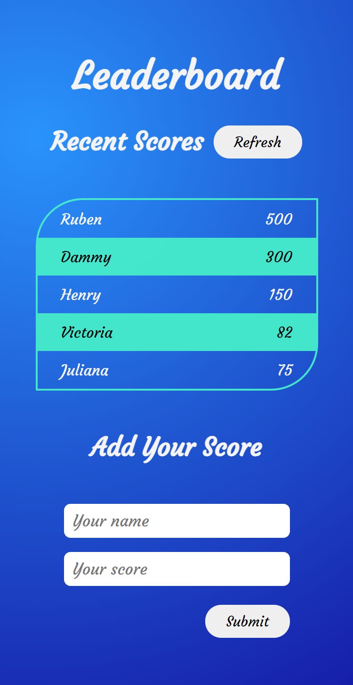

# Leaderboard

> Leaderboard is a website that has its data preserved with the external Leaderboard API serice. It displays the names and scores of different people and also allows you add your own score to the leaderboard.

# Demo Link

Click [here](https://dammyshittu.github.io/Leaderboard-Project/dist/) to view the website online.
# Screenshot

Width - 1440px

Width - 375px

# Getting Started

To get a local copy up and running follow these simple steps.

- You can clone this repo by typing `git clone https://github.com/DammyShittu/Leaderboard-Project.git` on your terminal.

- Type `cd Leaderboard-Project` to access the project on the terminal.
  
- Run `npm install` from your editor's terminal.

- Run `npm run build` from your editor's terminal.

- Run `npm start` from your editor's terminal to view the project in your browser.

- Run `npx hint` . to check for HTML Linter errors.

- Run `npx stylelint "**/*.{css,scss}"` to check for CSS Linter errors.

# This project was built with:

HTML5

CSS3

JavaScript

Webpack

# Version Control System

GIT

# 👤 Author

GitHub: [@dammyShittu](https://github.com/DammyShittu/)

Twitter: [@aded_shittu](https://twitter.com/aded_shittu/)

LinkedIn: [Adedamola Shittu](linkedin.com/in/adedamola-shittu-3ab465172/)

# 🤝 Contributing

Contributions, issues, and feature requests are welcome!

Feel free to check the [issues page](https://github.com/DammyShittu/Leaderboard-Project/issues).

# Show your support

Give a ⭐️ if you like this project!

# 📝 License

This project is [MIT](LICENSE) licensed.
